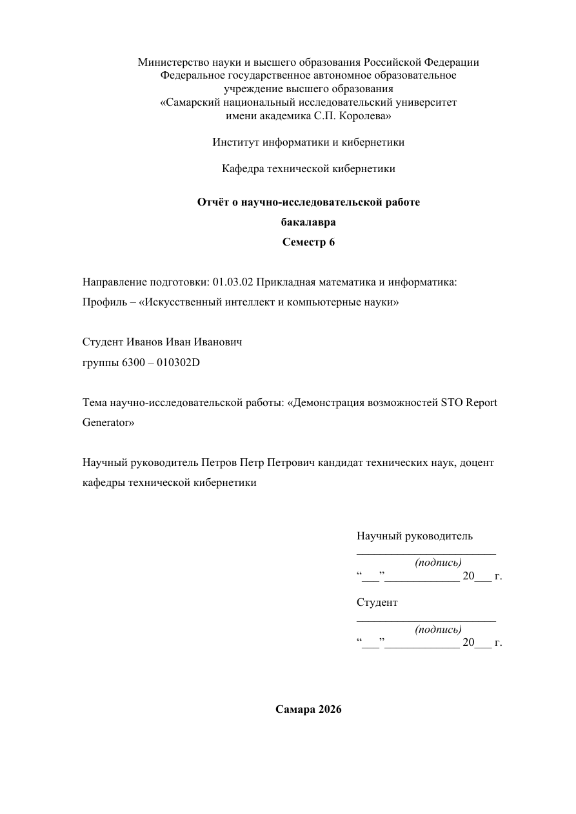
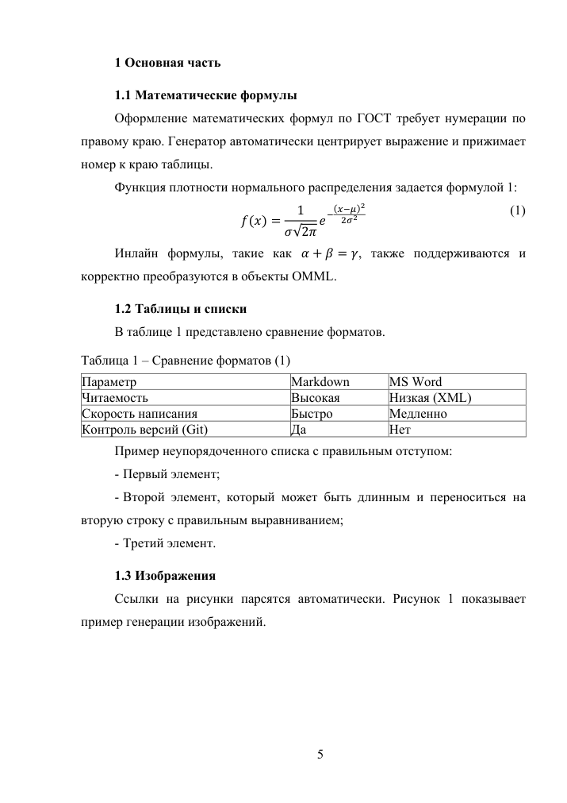

# STO Report Generator

STO Report Generator собирает русскоязычные академические отчеты `.docx` из модульных Markdown-файлов. Базовый продукт -
переносимая сборка DOCX и структурная проверка OpenXML без Microsoft Word. Это удобно для WSL, Linux, macOS, Windows,
CI и агентных сценариев.

Word-путь остается отдельным режимом: он нужен, когда требуется авторитетная пагинация, обновление полей Word и экспорт
PDF через установленный Microsoft Word в Windows.





## Быстрый старт

```bash
npm install
uv sync
npm run hooks:install
npm run new:report -- my_report --profile coursework --dir reports/my_report --title "Название темы"
npm run check:source -- reports/my_report
npm run generate:report -- reports/my_report --renderer portable --validate
```

Для комплексной проверки без Word:

```bash
npm run audit:report -- reports/my_report --renderer portable
```

Для финальной Word/PDF-проверки в Windows с установленным Microsoft Word:

```powershell
npm run audit:report -- reports/my_report --renderer word
```

## Что поддерживается

| Возможность                                                   | Переносимый режим | Word-режим |
| ------------------------------------------------------------- | ----------------- | ---------- |
| Создание структуры отчета                                     | Да                | Да         |
| Preflight исходных Markdown-файлов                            | Да                | Да         |
| Сборка `.docx` из Markdown, формул, таблиц, рисунков и BibTeX | Да                | Да         |
| Проверка структуры DOCX через OpenXML                         | Да                | Да         |
| Имена стилей Самарского шаблона через `stylePreset`           | Да                | Да         |
| Обновление полей Word и оглавления                            | Нет               | Да         |
| Авторитетная пагинация и PDF                                  | Нет               | Да         |

LibreOffice и Microsoft Graph пока остаются backlog: для них здесь не доказан desktop-identical контракт с Word. Electron
не входит в текущую границу продукта; основной интерфейс - CLI и агентные сценарии.

## Структура отчета

Обычный отчет хранится как набор отсортированных модулей:

```text
reports/my_report/
  00_metadata.md
  01_referat.md
  02_toc.md
  03_intro.md
  10_main.md
  90_conclusion.md
  91_sources.md
  references.bib
  images/
  report.config.json
```

`00_metadata.md` содержит данные титульного листа:

```markdown
---
department: 'Институт информатики и кибернетики'
subdepartment: 'Кафедра технической кибернетики'
reportType: 'Отчет по курсовой работе'
degree: 'по дисциплине "Название дисциплины"'
semester: 6
specialtyCode: '01.03.02'
specialtyName: 'Прикладная математика и информатика'
profileName: 'Искусственный интеллект и компьютерные науки'
studentName: 'Иванов Иван Иванович'
groupNumber: '6300 - 010302D'
topic: 'Название темы'
supervisorName: 'Петров Петр Петрович'
supervisorTitle: 'кандидат технических наук, доцент'
city: 'Самара'
year: 2026
bibliography: 'references.bib'
---
```

Пример содержательного модуля:

```text
\sto_structural_heading{ВВЕДЕНИЕ}

Цель работы - проверить сборку отчета по требованиям СТО.

Задачи работы:

\begin{sto_enum}
1. подготовить исходные Markdown-файлы;
2. выполнить preflight-проверки;
3. собрать DOCX и проверить стили.
\end{sto_enum}

Основные характеристики приведены в таблице 1.

Таблица 1 - Основные характеристики примера (@tab:example)
| Показатель | Значение |
|---|---:|
| Число разделов | 3 |

Иллюстрация показана на рисунке 1.


Рисунок 1 - Демонстрационный рисунок (@fig:example)
```

Макросы `sto_enum`, `sto_list` и `sto_bibliography` предназначены для исходников отчета. В документации они приводятся
только внутри fenced-примеров.

## Конфигурация

Основной пример настроен под переносимый режим:

```json
{
	"profile": "coursework",
	"renderer": "portable",
	"stylePreset": "samara-template-2022",
	"sourceDir": ".",
	"outputDocx": "build/my_report.docx",
	"document": {
		"requiredStructuralHeadings": [
			"РЕФЕРАТ",
			"СОДЕРЖАНИЕ",
			"ВВЕДЕНИЕ",
			"ЗАКЛЮЧЕНИЕ"
		],
		"optionalStructuralHeadings": [
			"ОПРЕДЕЛЕНИЯ, ОБОЗНАЧЕНИЯ И СОКРАЩЕНИЯ",
			"СПИСОК ИСПОЛЬЗОВАННЫХ ИСТОЧНИКОВ"
		],
		"requireReferat": true,
		"requireSources": "when-cited"
	},
	"preflight": {
		"strict": false,
		"softTextRules": "warning"
	},
	"postBuild": {
		"enabled": false,
		"exportPdf": false
	},
	"validate": {
		"enabled": true,
		"unpackDir": ".temp_docx"
	}
}
```

Word/PDF включается явно:

```json
{
	"renderer": "word",
	"postBuild": {
		"enabled": true,
		"exportPdf": true
	}
}
```

Пути в `report.config.json` должны быть относительными к папке отчета. Локальные абсолютные пути, личные каталоги,
закрытые ссылки и идентификаторы пользователей не должны попадать в README, инвентарь источников или публичные fixtures.

## Стили Самарского Шаблона

По умолчанию генератор сохраняет стабильные внутренние style ID: `Normal`, `StoHeading1`, `FigureCaption`, `TableText` и
другие. Если преподавателю важно видеть названия стилей из шаблона Самарского университета, добавьте:

```json
{
	"stylePreset": "samara-template-2022"
}
```

Preset меняет только отображаемые имена сопоставленных стилей. Тесты проверяют, что style ID и XML форматирования не
меняются.

## Проверки

```bash
npm run doctor
npm run check:source -- example
npm run audit:report -- example --renderer portable
npm run check:pack
npm run quality
```

`npm run doctor` показывает доступность переносимого режима и состояние Word-режима для текущей платформы. Он не должен
печатать личные пути.

## Preview

Изображения в `docs/assets/example-page-1.png` и `docs/assets/example-page-5.png` сгенерированы из демонстрационного отчета
`example/`. Они содержат только демонстрационные имена и placeholder-содержание.

Воспроизводимый renderer-agnostic сценарий:

```bash
npm run audit:report -- example --renderer portable
```

После этого можно открыть полученный DOCX в выбранном локальном просмотрщике и экспортировать нужные страницы в PNG. Для
публичной документации используйте только демонстрационный отчет `example/`, а не страницы частных работ.

## Частые проблемы

| Симптом                             | Что проверить                                                                                  |
| ----------------------------------- | ---------------------------------------------------------------------------------------------- |
| `audit` пропускает post-build       | Проверьте `--renderer`: portable сознательно не запускает Word.                                |
| Нужен PDF с точной пагинацией       | Запустите `npm run audit:report -- reports/<slug> --renderer word` в Windows с Microsoft Word. |
| Preflight отклоняет список          | Используйте `sto_list` или `sto_enum` в исходниках отчета.                                     |
| Preflight отклоняет `\begin{...}`   | Проверьте список окружений в `src/shared/config/sto-rules.json`.                               |
| Не найден рисунок                   | Укажите путь относительно папки отчета, например `images/chart.png`.                           |
| Цитата осталась как `[@key]`        | Добавьте запись в `references.bib` и проверьте поле `bibliography`.                            |
| Названия стилей не похожи на шаблон | Добавьте `stylePreset: "samara-template-2022"` в `report.config.json`.                         |

## Документация

- `docs/report-authoring.md` - правила написания Markdown-отчетов.
- `docs/sto-rules-coverage.md` - покрытие правил СТО проверками.
- `docs/architecture/dotm-template-style-audit.md` - безопасно извлеченные параметры DOTM fixture.
- `docs/architecture/python-post-build.md` - архитектура Word post-build.
- `docs/source-inventory.md` - публичная инвентаризация источников и preview provenance.
- `tests/README.md` - структура тестов.
